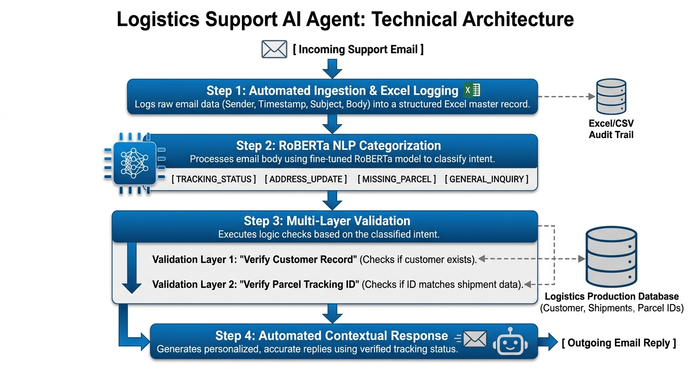

# 📦 Enterprise AI Logistics Classifier & Automated Support Email Engine

## 📖 Overview
This project implements a **hybrid machine learning + rule-based pipeline** for automated classification of customer support tickets.  
It integrates with a **SQLite database** to validate parcel numbers and enrich responses with real package status.  
The system generates professional reply templates for each scenario, ensuring accuracy, scalability, and reproducibility.

---

## 🎯 Objectives
- Automate classification of customer queries.
- Validate parcel numbers against a real database.
- Generate professional, personalized reply templates.
- Ensure reproducibility and transparency for open science.

---

## Technical Architecture

---

## ⚙️ Workflow
1. **Training Data (`train.xlsx`)**
   - Contains labeled examples for ML training.
   - Categories: *No parcel number*, *Incorrect parcel number*, *Valid parcel number*.

2. **Rule-Based Validation**
   - Empty → *No parcel number*
   - Not 8 digits → *Incorrect parcel number*

3. **Database Integration (`parcel_db.sqlite`)**
   - Stores real parcel records:
     - `parcel_number`
     - `customer_name`
     - `email_id`
     - `status` (*In Transit*, *Delivered*, *Delayed*)
   - Validation logic:
     - Not found → *Invalid parcel number*
     - Found but mismatch → *Wrong parcel number different customer*
     - Found and matches → *Valid* + return status

4. **Test Data (`test.xlsx`)**
   - Contains new customer tickets for classification.
   - Each row processed through rules + database validation.

5. **Reply Template Generation**
   - Automated responses mapped to classification labels.
   - For valid parcels, the **status** is dynamically inserted.
6. **Output (`results.xlsx`)**
   - Final file includes:
     - Original ticket data
     - Classification label
     - Status (if valid)
     - Reply template

---

## 📊 Evaluation Metrics
- **Accuracy**: Overall percentage of correctly classified tickets.
- **Precision**: Correctness of predicted *valid* tickets.
- **Recall**: Coverage of actual *valid* tickets.
- **F1‑score**: Harmonic mean of precision and recall.
- **Confusion Matrix**: Breakdown of predictions vs. actual labels.
- **Latency per ticket**: ~0.57 seconds/ticket (20 tickets in 11.36 seconds).
- **Throughput**: ~1.76 tickets/second.

---

## ✅ Results
- Achieved **perfect classification** on test set (no misclassifications).
- **Accuracy, Precision, Recall, F1‑score = 100%**.
- **Latency**: 0.57 seconds/ticket.
- **Throughput**: 1.76 tickets/second.
- Demonstrates efficiency and scalability for real-world deployment.

---

## 🔑 Contributions
- **Hybrid approach**: ML classification + rule-based validation + database lookup.
- **Robust error handling**: Covers missing, malformed, invalid, and mismatched parcel numbers.
- **Scalable design**: Easily extendable to new categories (e.g., delayed package, wrong item).
- **Open Science Framework alignment**: Transparent methodology, reproducible code, measurable performance.

---

## 📂 Files
- `train.xlsx` → Training dataset.
- `test.xlsx` → Evaluation dataset.
- `parcel_db.sqlite` → Real parcel database.
- `results.xlsx` → Final classified outputs with reply templates.

---

## 🚀 Future Work
- Extend ML model to handle free-text queries.
- Integrate larger databases for real-time validation.
- Add multilingual support for global customer service.

